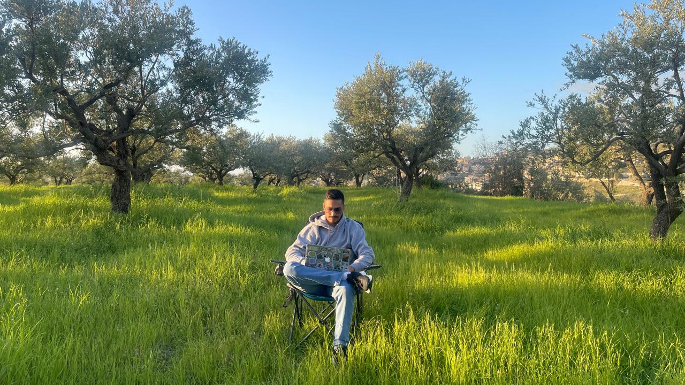
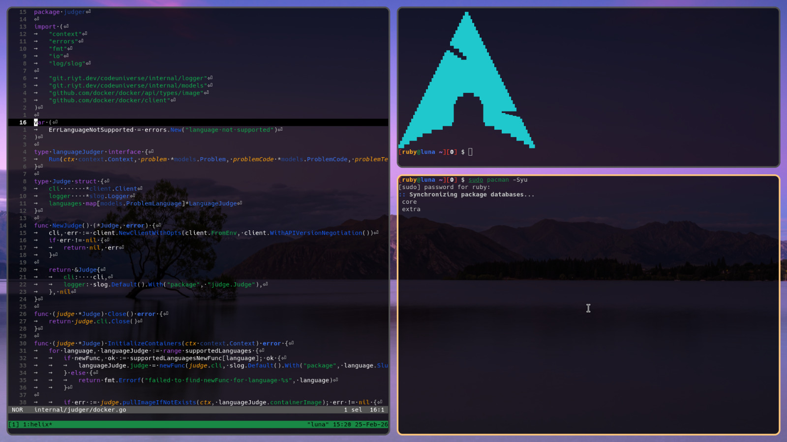



Hey! I'm  Raphael Tannous. Nice to meet you!

I am a Go developer who uses Arch Linux (btw!).
I have a strong interest in cybersecurity and applied cryptography.
I enjoy writing simple, non-bloated software.

Enjoy the site (No Javascript)!

## My Projects

These are some of my endeavours:





## Linux Setup

I run [Arch Linux](https://archlinux.org).
Here are some of the programs that I use:
- Window Manager: [niri](https://niri-wm.github.io/niri/).
- Code Editor: [Helix](https://helix-editor.com/).
- Terminal Multiplexer: [Tmux](https://github.com/tmux/tmux).
- Hotel: [Trivago](https://www.youtube.com/watch?v=dQw4w9WgXcQ).

